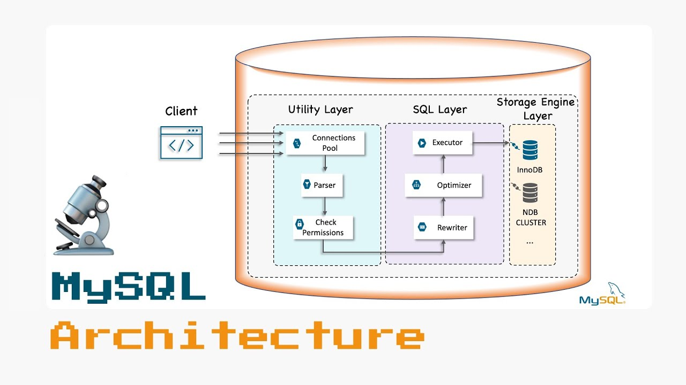
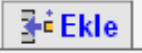
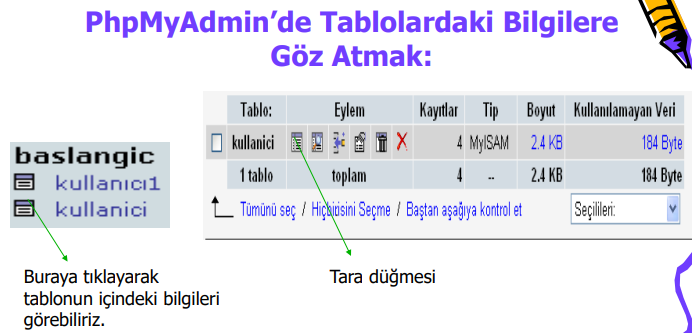
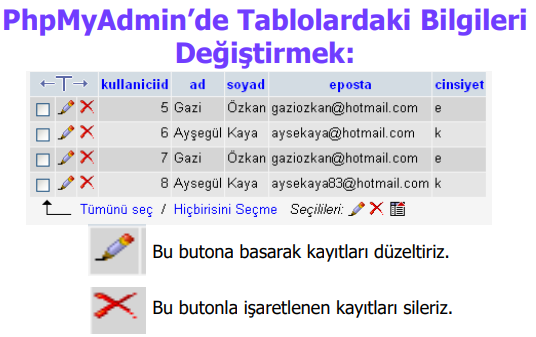
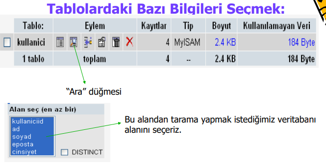
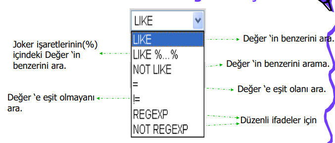
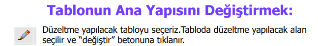
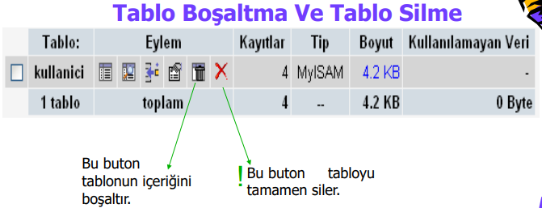
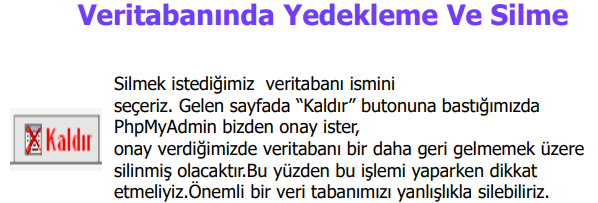

### What's MYSQL?
Bir veritabanı yönetim sistemidir. C/C++ kullanılarak yazılmıştır. (RDBMS = Relational Database Management System )

> What's Database, Table and Field ?
Database: Tabloların meydana getirdiği mantıksal bilgi kümesidir.
Table: Alanların bir araya gelerek oluşturdukları bilgi kümesidir.
Field: Veritabanının en alt birimi olup içinde ikilik formatta bilgi saklanır.

### MYSQL Architecture
Her veritabanı bir dizin, her tabloda bir dosyadır.


### Field Properties
Primary: Alanımızın ana anahtarı olarak belirlenmesini sağlar.
Index: Belirtilen alan içinde arama işlemlerini yüksek performansta yapabiliriz.
Unique: Her bir değerin bir kere bulunması gereken durumlarda kullanırız.
Auto_increment: Eklenen her yeni satıra otomatik olarak bir sıra numarası vermek için kullanırız.

### PHPMyAdmin 
Tabloya veri girmek için:
















### MySQL Field Types
İşte sana mükemmel bir özet dostum 🙂🙌

**Sayısal Veriler:**

* **TINYINT:** 0-255 arası küçük tamsayılar (byte)
* **SMALLINT:** -32768-32767 arası tamsayılar (short)
* **MEDIUMINT:** -8388608-8388607 arası tamsayılar (integer)
* **INT:** -2147483648-2147483647 arası tamsayılar (long)
* **BIGINT:** -9223372036854775808-9223372036854775807 arası tamsayılar (bigint)
* **FLOAT:** Ondalıklı sayılar (4 byte)
* **DOUBLE:** Ondalıklı sayılar (8 byte)
* **DECIMAL:** Ondalıklı sayılar (tam ve kesirli basamak sayısı belirtilebilir)

**Alfasayısal Veriler:**

* **CHAR(n):** n karakter uzunluğunda sabit metin (n max 255)
* **VARCHAR(n):** En fazla n karakter uzunluğunda değişken metin (n max 255)
* **TINYTEXT:** 255 karaktere kadar kısa metinler
* **TEXT:** 65535 karaktere kadar orta uzunlukta metinler
* **MEDIUMTEXT:** 16777215 karaktere kadar uzun metinler
* **LONGTEXT:** 4294967295 karaktere kadar çok uzun metinler

**Diğer Veri Türleri:**

* **DATE:** Tarih değerleri
* **TIME:** Saat değerleri
* **DATETIME:** Tarih ve saat değerleri
* **TIMESTAMP:** Zaman damgası (timestamp)
* **BLOB:** İkili veri (byte dizisi)
* **ENUM:** Belirli bir değer kümesinden seçim yapılabilen alan
* **SET:** Birden fazla değerin seçilebileceği alan

**Notlar:**

* Veri türü seçerken, saklanacak verinin türüne ve boyutuna dikkat edilmelidir.
* Doğru veri türü seçmek, veritabanı performansını ve tutarlılığını artırır.
* MySQL'de daha fazla veri türü ve seçeneği mevcuttur.

**Örnek:**

```sql
CREATE TABLE users (
  id INT PRIMARY KEY AUTO_INCREMENT,
  name VARCHAR(255) NOT NULL,
  email VARCHAR(255) UNIQUE,
  age TINYINT,
  created_at DATETIME DEFAULT CURRENT_TIMESTAMP
);
```

Bu kod, `users` adında bir tablo oluşturur. Tabloda 5 alan vardır:

* `id`: Birincil anahtar, otomatik artan tamsayı
* `name`: En fazla 255 karakter uzunluğunda, boş bırakılamaz metin
* `email`: Eşsiz, en fazla 255 karakter uzunluğunda metin
* `age`: 0-255 arası tamsayı
* `created_at`: Oluşturma tarihi ve saati (varsayılan olarak otomatik güncellenir)

### MySQL Table Types

MySQL, iki farklı tür tablo yapısını destekler:
- Transaction Tabloları :
    1. InnoDB
    2. Berkeley DB 
- Atomik İşlem Tabloları :
    1. MyISAM
    2. HEAP
    3. MERGE
    4. ISAM 

**IMPORTANT NOTE:** Her tablo için farklı bir tablo tipi seçilebilir. Veritabanımızda iki ya da daha fazla tablo tipini bir arada kullanabilirsiniz.